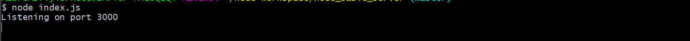
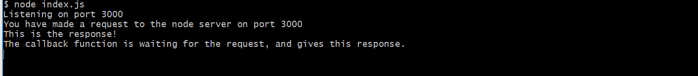

# A Basic Node Server

## What is Node?
* Node is a web server.  Not a framework.

## How to setup a basic server in Node
### Requiring the Module

* Node has some built-in modules that we can use.  One of them is called *http*, so lets import that now using *require*.
* In this code, we require a module for this JS file:
```
  var http = require('http');
```
* Here, we are **setting a variable *http*** to the module http.  Now all of 'http' module functions can be used by the variable.


### Creating the Server
* Now, one of those functions is to create a server:
```
  http.createServer(function(request, response) {
    // some stuff
  });
```
* So, we create a server, added a **'callback' function**, which will be described soon.  We aren't done yet,
because we haven't setup the port for the server to listen on.  You do that like this:

```
  http.createServer(function(request, response) {
    // some stuff
  }).listen(3000);
```

* Now, you can **run this server by typing 'node index.js' in the console**, and you have a server running!  But...alas..it does nothing atm.
* Lets set a console log so we can see something happening:

```
  console.log("Listening on port 3000");
```

* Now, if you stop the server (ctrl + c), and re run it, you will get a console output.
* So, lets go over whats happening here.
  * We started a server on port 3000, and we get a console log output.  NodeJS is non-blocking, meaning we can run code while other code is being run.  
  But, NodeJS is still a single-threaded server.  


### The callback function
* It gets around this by using what's called a callback function:

```
  http.createServer(function(request, response) {
    // some stuff
  });
```

* The **function(request, response)** is the callback function.  This waits for a request and while it's waiting, it continues to execute code after the **http.createServer block**.  So, a request would be visiting localhost:3000, which would then execute the callback function code.  NodeJS also calls the way it waits for a request an **Event Loop**.
* When Node gets that request, it will now execute the callback function, and run that code.  Let's do that now:

```
  http.createServer(function(request, response) {
    console.log("You have made a request to the node server on port " + port);
    console.log("This is the response!");
    console.log("The callback function is waiting for the request, and gives this response.");
  }).listen(port);
```

### Running the Server
* So, if we run the server, we get the following <br />



* As you can see, we see "Listening on port 3000", but not the console.log within the callback function.  We haven't made a request yet, so it won't be executed, and the REASON we see "Listening on port 3000", is because of the non-blocking code Node uses.  We need to make a request to see the console.log inside the callback function.  Go to localhost:3000, and you will now see: <br />

